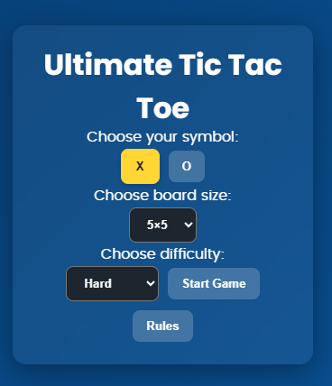

# Ultimate Tic Tac Toe

A **React-based Tic Tac Toe game** with variable board sizes (3×3, 4×4, 5×5) and adjustable difficulty levels. Play against an AI opponent powered by **Minimax algorithm**. Features a sleek, modern UI with blur/glassmorphism effects.

---

## 📖 Features

- **Board Sizes:** 3×3, 4×4, 5×5
- **Difficulty Levels:** Easy, Medium, Hard (AI uses Minimax on small boards)
- **Game Modes:** Player vs Computer
- **Score Tracking:** Wins, Losses, Draws
- **Modern UI:** Glassmorphism, responsive design, animations for winning cells
- **Rules Modal:** Easy-to-read instructions
- **Reset Game:** Quickly restart without page reload

---

## 🖥️ Demo

[TicTacToe live demo](./demo.png)

---
## 🖼️ Screenshot


---

## ⚙️ How to Play

1. Launch the app by running:

```bash
npm install
npm run dev
```
2. Select your symbol (X or O).

3. Choose a board size.

4. Select difficulty (Easy, Medium, Hard).

5. Click **Start Game**.

6. Click on cells to place your symbol.

7. Watch the AI make its move and try to win!

8. Check your score in the scoreboard and reset anytime.

---
## 🧩 Technologies Used

React

Vite

JavaScript

CSS3 (Glassmorphism & Animations)

Minimax Algorithm for AI logic

---

## 📂 Project Structure
```bash 
tic
├── README.md
├── eslint.config.js
├── index.html
├── package-lock.json
├── package.json
├── public
│   ├── screenshot.png
│   └── vite.svg
├── src
│   ├── assets
│   │   └── react.svg
│   ├── components
│   │   ├── App.jsx
│   │   ├── Board.jsx
│   │   ├── Cell.jsx
│   │   ├── RulesModal.jsx
│   │   ├── Scoreboard.jsx
│   │   └── Setup.jsx
│   ├── index.css
│   ├── main.jsx
│   └── utils
│       └── gameLogic.js
└── vite.config.js
```

---
## 🎯 AI Logic

- **Easy**: Random moves

- **Medium**: Blocks player or makes random moves

- **Hard**: Full **Minimax algorithm** (3×3 and 4×4)

- 5×5 hard may take longer due to combinatorial complexity
---

## 📱 Responsive Design

- Works on **desktop, tablet, and mobile**

- Cells automatically adjust to fit the board

- Winning cells glow with an animated effect

---

## 🔧 Installation

1. Clone the repository:
```bash
git clone https://github.com/Stabat47/tic-tac-toe.git
```

2. Install dependencies:
```bash
npm install
```

3. Start the development server:
```bash
npm run dev
```
Open your browser at [http://localhost:5173](http://localhost:5173)

---

## 📝 License

MIT License © 2025

---

## 💡 Future Improvements

- Add **multiplayer online mode**

- Implement **undo/redo** moves

- Improve AI heuristics for 5×5 boards

- Add **themes and color customization**

---

## Author

**Landoh Clansy**
Full-Stack Developer | Data Analyst | ML Enthusiast 